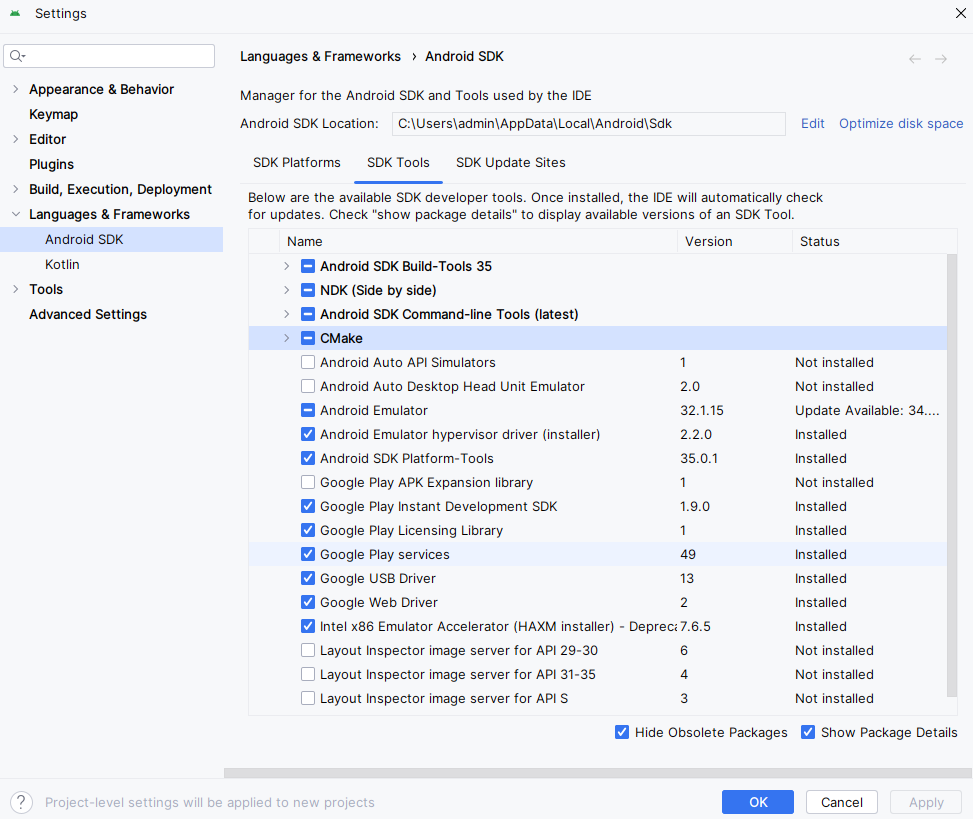

# Flutter

Configuração de um ambiente flutter.

## Software requirements

- [Git](https://git-scm.com/)
- [Android Studio](https://developer.android.com/studio?hl=pt-br)
- [Google Chrome](https://www.google.com/intl/pt-BR/chrome/)
- [Visual Studio (Caso precise desenvolver para windows)](https://visualstudio.microsoft.com/pt-br/)

## Text editor or IDE

- [Visual Studio Code](https://code.visualstudio.com/)
- [Android Studio](https://developer.android.com/studio?hl=pt-br)
- [IntelliJ IDEA](https://www.jetbrains.com/)

```bash
  Obs: É necessário instalar junto ao editor ou IDE o plugin 
  no caso das IDE Android Studio e IntelliJ IDEA e a extensão 
  no caso do Visual Studio Code.
```

## Flutter SDK Download

- [Flutter SDK Windows](https://docs.flutter.dev/get-started/install/windows/mobile)
- [Flutter SDK Mac OS](https://docs.flutter.dev/get-started/install/macos/mobile-ios)

## Instalação SDK

Escolha um local para extrair a SDK.

Adicione a variável de ambiente.

Adicione uma nova variável.

`FLUTTER_HOME`


Agora, adicione a nova variavel a Path.

Procure pela variavel Path e clique em editar.

agora adicone ela no final.


## Configuração Android Studio

Acesse o SDK Manager no android studio e instale.

- **Android SDK Platform, API 34.0.5**
- **Android SDK Command-line Tools**
- **Android SDK Build-Tools**
- **Android SDK Platform-Tools**
- **Android Emulator**

Acesse o menu no sdk manager, SDK Tools

Caso não esteja adicionado, marque:

- Android SDK Command-line Tools
- CMake (Para desenvolvimento windows caso vá usar)

- Google Play Instant Development SDK
- Google Licensing Library
- Google Play service
- Google USB Driver
- Google Web Driver



Adicione a variável de ambiente.

`ANDROID_HOME`


Agora, adicione a nova variavel a Path.

Procure pela variavel Path e clique em editar.

agora adicone ela no final.


## Android licenses

No terminal execute

```bash
  flutter doctor -v
```
agora execute

```bash
  flutter doctor --android-licenses
```

e aceite todas as licenças e em seguida execute novamente.

```bash
  flutter doctor -v
```

Todas requisitos devem estar corretos. Caso tenha optado por não desenvolver para windows a opção de desenvolvimento no comando executado irá estar marcada como errada, mas não é obrigatorio caso não vá utliza-la.


## Emulador Android

### Dispositivo Fisico

Libere a opção de desenvolvedor no android.

Caso opte por usar um dispositivo fisico para o desenvolvimento,
conecte o smarthphone via usb, aceite o depurador usb e quando for executar o projeto selecione o dispositivo.

### Dispositivo Emulado

Criação de uma Emulador Android.

Entre na opção Virtual Device Manager.


Clique em +


Selecione o modelo.


Selecione a versão da sdk que deseja.


Caso opte por retirar o template do dispositivo desmarque a opcao Enable device frame.


Clique em finalizar.

Para abrir o dispitivo clique através da lista de dispositivos no 3 pontinhos e abra por cold boot. (Nesse modo de abertura sempre será iniciado o dispositivo sem cash).

## Autor

- [Alan Felix](https://github.com/AlanFelixDEV/)

## Referência

- [Flutter](https://docs.flutter.dev/get-started/install)

